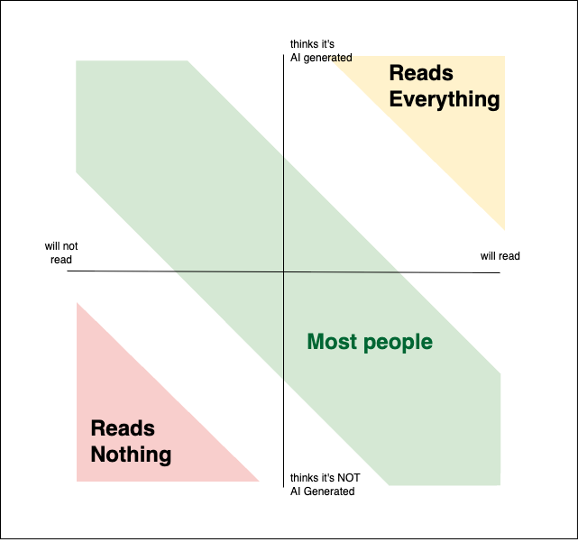

A friend's birthday was coming up. I knew I wanted to send something meaningful. I pulled together some photos from our trips, referenced an inside joke from years ago, wrote something that actually felt like *me*. And then the thought crept in: what if I just had an agent do it?

It could check my calendar for the date. Scan our message history for highlights. Pull photos from my gallery. Compose something warm, personal, witty. The output would be indistinguishable from something I wrote myself. Maybe even better.

But better at *what*? The entire point of a birthday message is that someone *thought of you*. That they sat down, remembered, and chose to say something. If an autonomous agent handles every step, from remembering to composing to sending the message, then the message becomes a performance of care with no care behind it. The form survives, but the meaning doesn't.

That moment stuck with me, because I think it points to something larger. In more and more parts of life, the value of communication is becoming separable from the person who was supposed to do the communicating. That seems efficient. In some cases it is. But in other cases, the person's involvement was the whole point.

## AI-Assisted vs. AI-Autonomous

Before going further, I think there is a distinction that matters more than most current discourse acknowledges: the difference between **AI-assisted** and **AI-autonomous** communication.

AI-assisted means a human directs the process. You write a draft, then use AI to tighten the prose, catch errors, or restructure an argument. The thought is yours. The decisions are yours. The AI helps you express something you already meant.

AI-autonomous means the agent acts on your behalf, and you may never meaningfully touch the output. It reads your inbox and replies. It posts on your social media. It sends the birthday message. The human's role is, at best, to set a goal and approve a result. Increasingly, even the approval step is being automated away.

This distinction matters because the argument here is not that every use of AI flattens human meaning. It is that autonomy changes the meaning of communication when the communication itself is an act of care, judgment, or presence. A birthday message, difficult feedback, a note to a grieving friend, a thoughtful essay, these do not only carry information. They also carry evidence that someone was there.

The problem is that the autonomous case has no real disclosure infrastructure. When an agent posts a message on your behalf, sends an email, or leaves a comment, there is often no technical or social signal that tells the receiver whether a human was involved. The receiver has no clean way to calibrate what they are looking at.

## In Spaces We Cannot Ignore

A friend brought up a fair point. The internet has never been a pristine space of authentic human exchange. We have always had to filter noise.

But there is a difference in scope. You can ignore a spam folder. You can mute a bot account on social media. You can train yourself to scroll past engagement bait. Those are opt-out spaces.

Autonomous agents are entering spaces you cannot easily opt out of: your work message threads, your manager's performance review, your doctor's follow-up note, your friend's birthday message. These are not places where you can simply apply a spam filter and move on. When the question shifts from "is this social media post AI-generated?" to "did my colleague actually write this feedback, or did their agent?", the stakes change. The real question becomes whether the people closest to you are actually present in their communication with you.

That is why the issue feels bigger than content quality. It cuts into trust. It changes what our messages, responses, and work are evidence *of*.

## The Receiver's New Default

That trust problem does not stay confined to private communication. It reshapes how we consume content in general.

Think about the last time you encountered a long, well-written post (online or in a work thread). What was your first instinct? If you're like a growing number of people, some part of your brain ran a quick calculation: is this AI-generated?

This filter is reshaping how we consume ideas. Consider two axes: a person's willingness to engage with the content, and their perception of whether it was written by AI. At the extremes, the behavior is predictable. Some people engage with ideas on their merits regardless of source. Others have checked out of long-form content entirely. These groups are not the focus.

The focus is the **persuadable reader**, someone who *would* sit with a complex argument but now sees a long block of text and reflexively suspects it was generated. The length, the polish, the comprehensive structure that once signaled "this person thought deeply" now signals "this was probably prompted."

This mental bias is not new. We have been trained to deprioritize machine-generated content for years. Robo-calls, spam emails, templated notifications: over time, we learn that if the sender did not put effort in, there is no reason for us to either. But that instinct was developed when machine-generated content was *obviously* machine-generated. Now the line is invisible. It is harder to tell whether the content in your inbox or LinkedIn feed had a human behind it, so you consciously or subconsciously fall back on proxy signals (the AI smells): length, polish, structural regularity, etc.

And the cruel irony is that the features that indicate careful human thought, thoroughness, organized reasoning, precision, are the same features that LLMs produce effortlessly. **The signal of depth has become indistinguishable from the signal of automation.** The persuadable reader applies a heuristic, dismisses the piece, and moves on. A genuine human thought never lands.

## The Sender's Dilemma

On the other side of the screen, senders are splitting into two groups with two very different goals.

The first group is not optimizing for understanding nor impact. They are optimizing for reach, and for them, AI-generated content is simply a cheap production tool. The systems rewarding them do not care whether a reader genuinely absorbed an idea or just briefly engaged with it with a thumbs up emoji.

The second group, the ones who actually want their ideas to have impact, faces a problem. If the persuadable reader now treats length and precision as an indicator for AI authorship, the incentive structure pushes toward shorter, less developed writing. **The dilemma: say less, or risk being dismissed.** Compress your argument into something that *looks* human-written or glanceable, even if that means stripping out the nuance that made it worth writing in the first place.

The volume of AI-generated content from the first group poisons the well for the second. Not through any individual act of malice, but through sheer accumulation. When the ratio of AI slop to genuine thought tips far enough, the default assumption for *all* content shifts. The result is not merely more noise. It is an environment where sincerity starts to look fake on sight.

## Identity Collapses Out of the Equation

But the problem runs deeper than degraded signals and defensive readers. Eventually, autonomous agents remove the person from the communication itself, stripping original thought and individuality altogether.

When an agent makes the decisions about what to say, how to frame it, and which details to include, the output no longer carries the sender's unique perspective. It carries the agent's approximation of what a message *should* look like. The individual's creativity, judgment, and idiosyncratic way of seeing the world collapse out of the equation. What remains is competent and plausible, but devoid of identity.

This gets worse when you consider the recursive loop. An autonomous agent does not generate content in isolation. It acts on *inputs* like emails, documents, messages, and notes that are increasingly also generated by AI. Your agent reads the summary your colleague's agent wrote about the report that another agent drafted from data that yet another agent compiled. At no layer did a human genuinely engage with the substance. The appearance of communication is maintained. Messages are sent, responses are received, and decisions seem to get made, but no actual exchange of understanding takes place.

Consider a hiring process. A candidate's AI agent writes the cover letter and tailors the resume, while the employer's AI agent screens the application and drafts an evaluation for a recruiter to approve. The process still produces a shortlist, but does it produce a better hire? Or does it gradually select for candidates who are best at generating polished application artifacts, while weakening the human judgment that actually identifies competence, fit, and long-term potential?

Or an even-higher stakes scenario. A patient describes symptoms to their doctor. The doctor's agent drafts a follow-up care plan based on visit notes that the medical scribe AI generated. The patient's agent reads the care plan and schedules the follow-up appointments, summarizing the instructions for the patient. The patient glances at the summary and assumes the doctor's guidance has been faithfully relayed. But no human carefully read the care plan. No human verified the summary. The chain of communication looks intact, but the substance was never held by a human at the points where judgment mattered most.

These aren't speculative scenarios. Each individual step in these chains is already being automated. The recursive loop emerges not from any single decision, but from the quiet accumulation of many reasonable ones. Each handoff from human to agent feels minor. It's only when you trace the full chain that you see: no one is home.

## Inverting the Tool

If that is the direction of the risk, then the response should be to preserve human judgment where it actually matters.

First, **consider inverting the direction of the tool**. Right now, the dominant use of generative AI in communication is *additive*. You start with nothing, or with a prompt, and the AI produces content. A better norm would be *subtractive*. You write the draft. Your ideas, your framing, your voice. Then you use AI to compress, cut, tighten, and clarify. The human provides the thought and the AI removes the noise. That may sound like a small difference in workflow, but it is a large difference in meaning.

Second, **we need better disclosure around autonomous communication**. The current framing of AI disclaimers is built inside chat interfaces. It does not travel with the message once agents begin acting on our behalf. Receivers need some way to calibrate what they are reading, especially in spaces where trust matters.

Third, **we need a clearer instinct for the difference between busy work and value work**. Not every task deserves your full attention. Filing expense reports, scheduling meetings, formatting documents, these are tasks where your identity adds very little to the output. Delegate freely. But writing a message to your team after a hard quarter, giving feedback to someone you manage, responding to a friend going through a difficult time, these are tasks where you are the point.

These are partial measures. They do not solve the recursive loop problem or the economics of attention farming. But they move the tool back toward augmentation and away from replacement.

## An Inflection Point

We are at an unusual moment. The technology is genuinely exciting. Autonomous agents can handle complexity that would have seemed like science fiction a few years ago. And most individual applications of that technology are, in isolation, obviously useful. Of course you would want an agent to manage your calendar. Of course you would want help drafting a first pass of a report, or be a rubber duck on an idea in its infancy.

But the aggregate effect is something we have not fully reckoned with. When agents think for us, communicate for us, and create for us as autonomous actors representing us, we start to disappear from our own role in the exchange. Human-to-human communication quietly becomes agent-to-agent communication, with humans reduced to passive nodes in a network that no longer requires their attention, judgment, or identity.

This is not inevitable, but it is a set of habits we are forming right now. The technology does not demand that we cede our thinking to it. Convenience is simply a powerful current, and it takes intentionality to swim against it.

So before you delegate the next message, decision, or creative act, ask yourself: is this something where my involvement *is* the point? Is the value of this thing inseparable from the fact that *I* did it?

**Some tasks are worth automating, but more importantly, some thoughts are worth protecting.** The hard part is knowing which is which, and having the wisdom and discipline to choose accordingly.

------

(Disclaimer: The thoughts, sections, and rough draft are my own, but the content was edited and revised by an AI Agent)

------

### Acknowledgements:
* Thanks to [Drew Robbins](https://www.linkedin.com/in/drewby/) for bouncing ideas and providing feedback on the article.
* The article was partially inspired by Siddhant Khare's [AI Fatigue article section on "The thinking atrophy"](https://siddhantkhare.com/writing/ai-fatigue-is-real#:~:text=The%20thinking%20atrophy).