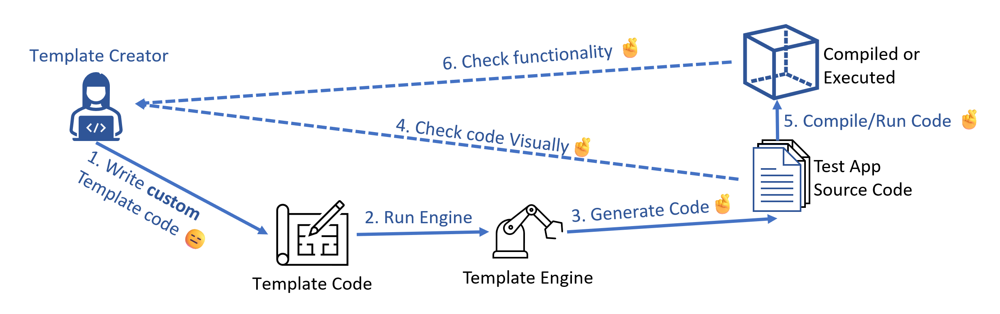
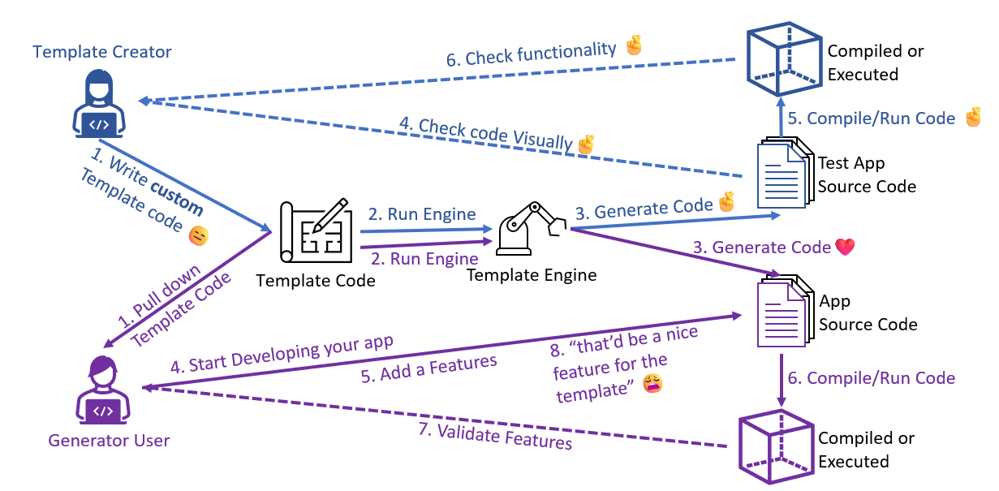
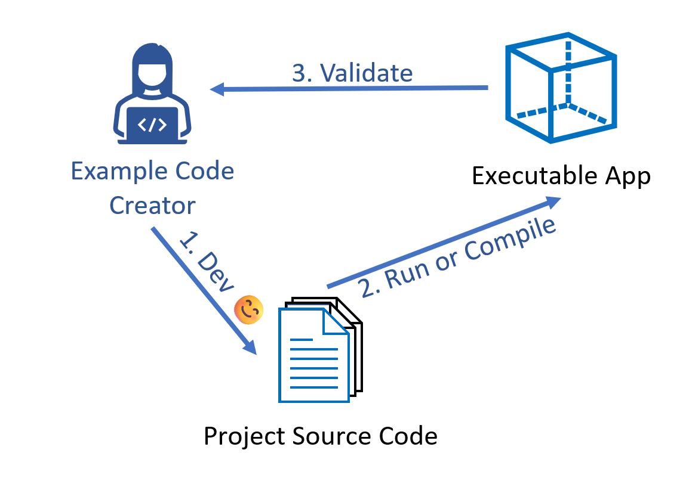
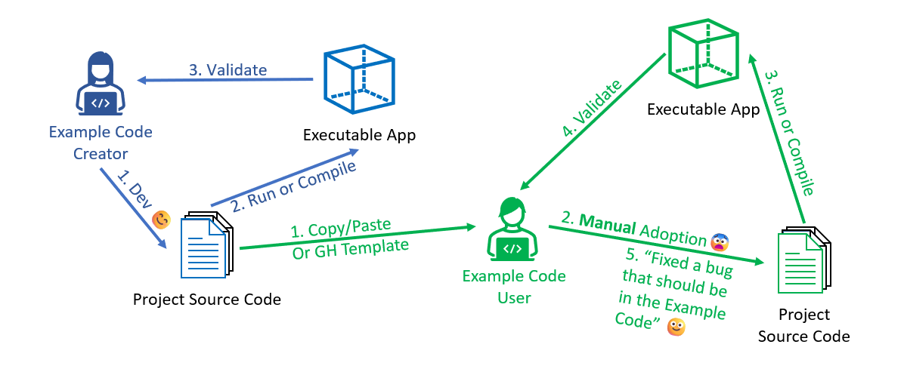
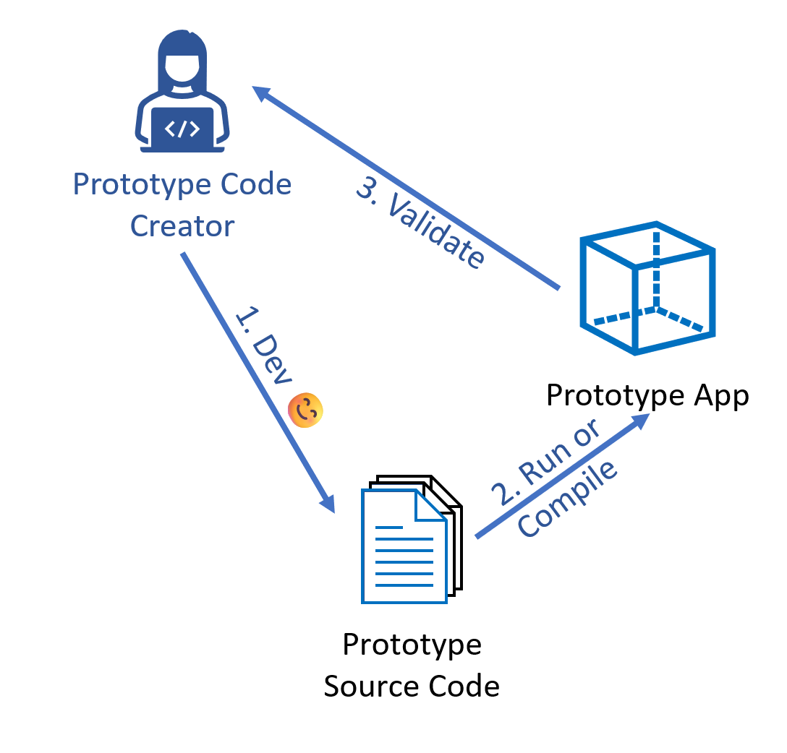
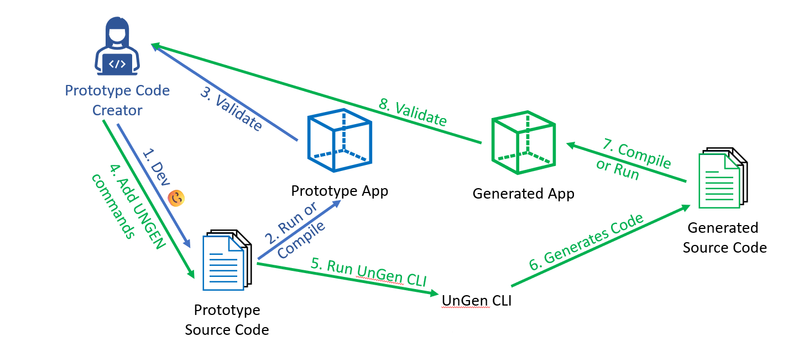
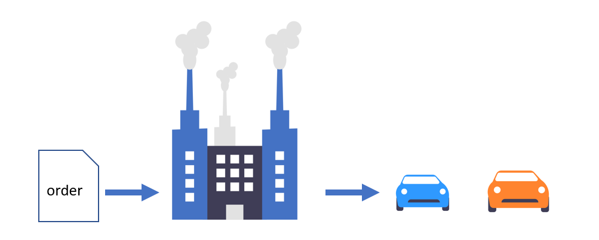

As developers, we **love** using code generators. They represent something exciting, a new beginning. These tools seem to magically lay the foundation to the projects that we want to create. They provide a way for us to stay consistent and utilize best practices without friction. However, when it's time for us to create our own template projects, we quickly realize the work involved.

This blog post will highlight the issues with the current state of generating code: using templated code or using example code, and finally propose a different, new approach.

## Current State of the Code Generators, Option #1: Templated Code

Before we start diving into the world of templated code, let's define some terms:

- **Code Generator**: Software that will take a source project and create a new project with it. Examples of code generators are [Yeoman](https://yeoman.io/) and [Cookiecutter](https://www.cookiecutter.io/).
- **Template Code**: Template code is code that is meant to be fed into a template engine. [This `package.json` file in the vscode-generator-code repo](https://github.com/microsoft/vscode-generator-code/blob/main/generators/app/templates/ext-command-ts/package.json) is an example of a template code. Template code is usually a domain-specific-language only a particular template engine can understand, which means it can't be understood by the target language.
- **Template Engine**: Template engine takes the template code and values gathered from the user to generate new code. Sometimes code generators use their own template engine (like Yeoman does), but sometimes code generators will use an existing template engine to help with adaptability (like Cookiecutter uses Jinja2 for its template engine).


Let's take a look at what is all involved in creating our own project with template code using code generators:

1. You create a new template project or use a tool (like [Yeoman's `generator-generator`](https://github.com/yeoman/generator-generator)), and you write the custom template code.
2. You run the template engine to generate the target code
3. (The Template Engine generates the target code)
4. You visually check to see if the code looks right
5. You compile or run the generated code
6. Check to see if the execution has the desired effect



This dev cycle, required by the fact we need to run template engine, just isn't how software developers typically develop an application. The reward of all of this is when you use the "finished" generator, and it still feels like magic (so you still feel the sweat and tears you put into the template project is still worth it)! 

However, as soon as you, or someone else realize that the template project needs to be updated, the dread sinks in, because it would mean that they have to go back into template land and repeat the tedious process of writing custom template code, visually check the generated code, and then check the generated code's functionality all over again. **In my personal experience, my handful of well-intentioned template projects quickly get abandoned.**

In summary the entire flow, with using the template code generator, would look like this:


There are also some inherent issues with a template project. The biggest of which is that template code is **not executable code**. This means we can't run static code analysis on the template code, or automate the process of regularly checking for outdated dependencies. Most of the time, we cannot even run the template code, period.

## Current State of the Code Generators, Option #2: Example Code

Because of the tedious dev loop of developing our own template project, devs sometimes would take a different approach: Example code projects. For example, here is [the Azure code samples page](https://learn.microsoft.com/en-us/samples/browse/) which has thousands of code example projects that can help you get started on building essentially anything you want on Azure.

> Note: Some "Code Generators" use example code as the source project, such as [Astro Template](https://docs.astro.build/en/install-and-setup/#use-a-theme-or-starter-template) or [GitHub Template Repos](https://docs.github.com/en/repositories/creating-and-managing-repositories/creating-a-template-repository). These code generators are effectively code cloners without much logic or transformation to the source code.

So what would you have to do to develop an example code repo?

1. You create a new project (probably from a well-maintained template project), and you write your application code.
2. You compile or run the code
3. You validate to see if your app is working as expected



This is great because this is the dev loop that software engineers are used to! However, the friction comes when it's time to use the example code project. You would need to **copy/fork the example code, then follow some written instruction to manually change the code to adopt it.** This is not fun. There is no magic. And if it doesn't immediately work after you've made the changes, you wouldn't be sure if you made a mistake changing the code, or if the code didn't working in the first place.

The nice thing about example code though is that because it's the same code as your "generated" code, if there is a point you'd like to update the example code, it's no mental hurdle because you are updating in the same language as the code you've been writing.

So, in summary, the entire usage flow would look like this:



## Recap of the two options for the current state of Code Generators

To recap the pros and cons between Templated Code and Example Code

| Templated Code                   | Example (Executable) Code          |
| -------------------------------- | --------------------- |
| ✅ Fun to Use (Feels like Magic) | ✅ Fun to Develop     |
| ✅ No manual edits               | ✅ Easy to Validate   |
| ✅ Not Error-Prone               | ✅ Easy to Update     |
| ⛔ Not Fun to Develop            | ✅ Can use dependabot |
| ⛔ Difficult to Validate         | ⛔ Not Magical        |
| ⛔ Difficult to Update           | ⛔ Manual Edits       |
| ⛔ Can’t use dependabot          | ⛔ Error Prone        |

<br />

-------------------

## A Different Approach

The pros and cons between the two are perfect inverse of each other. Why can't we have the best of both worlds?

What if your Executable Code **is** your Template Code? Let's call this type of code **Prototype Code**

| Prototype Code          |
| ----------------------- |
| ✅ Fun to Develop       |
| ✅ Easy to Validate     |
| ✅ Easy to Update       |
| ✅ Can use dependabot   |
| ✅ No manual edits      |
| ✅ Not Error-Prone      |
| ✅ Is Language Agnostic |
| ✅ Feels like magic!    |

<br />

## Introducing [UnGen](https://github.com/howlowck/ungen)

This tool allows you to write Prototype Code.

In short, UnGen gives your line comments the ability to change your code. Simply by tagging your line comments with `UNGEN:` (like you would with a `TODO:`), you've just made your executable code into a living template code.

Here is an example of an UnGen command:  
```js
// UNGEN: replace "World" with kebabCase(var.appName)
app.get("/", (req, res) => res.send("Hello World!!"));
```

This command tells UnGen "on the next line, replace any occurrences of the string "World" with the value of a variable called `appName` after transforming it to kebab-case first."

Then when you run the `ungen` cli command:

```sh
ungen -i . -o new-app -var appName="Haos New App"
```

It will generate your code into a new directory (specified by the `-o` flag) called "new-app". In there you'll find the following generated code:

```js
app.get("/", (req, res) => res.send("Hello haos-new-app!!"));
```

By using comments, the transformation instructions is out of the way of your executible code.

## Flow With UnGen:

When you want to create a Prototype Project like you would an example code project:
1. Create/Build your app
2. Compile/Run your app
3. Validate



You can then add the UnGen commands into the comments of your project, generate the code, and validate like you were writing a templated project:


## Prototypes: An Analogy

Let's say your application code is a car. So far, code generators are seen as the factories that builds the car. 



Now imagine you have a magic wand where you have the power to create new cars based on an existing car and apply any changed you'd like to the new car with one-fell-swoop.


We wouldn't need to build the complicated factories anymore.  
**UnGen gives you that power with your code**.  

## UnGen Usage Patterns

Since UnGen is just a simple cli tool that reads UnGen commands (comments in your code) and generates new code, it's an extremely flexible tool.

Here are some potential patterns you can use UnGen to create new projects

* **Ideal**: You could build the application like you would an example code repo. It's an "ideal application". Then use this "ideal app" to transform this one application into unlimited new applications. In fact, you can just add UnGen comments into your existing example apps.
* **Prototypal**: You could decentralize the proliferation of new application by decorating your latest application code.
* **Ocean Boiler(plate)**: You could have a centralized application, but "boil the ocean" with all the integrations and features possible. Then use UnGen to remove or delete parts of the application based on user preference.  

|            | Ideal | Prototype | Ocean Boiler |
|------------|-------------|-----------|--------------|
| Centrality | Centralized | Decentralized | Centralized |
| Repo Size  | Medium | Any | Large |
| Primary UnGen Operation| Transform | Transform | Remove |

## Tooling

Along with the UnGen tool, I also created some tooling around using this tool:
* [UnGen GitHub Actions](https://github.com/howlowck/ungen-action) - This Github Action Package allows you to run UnGen within your GitHub Action with ease
* [UnGen VSCode Extension] - (WIP) This Language Extension supports syntax highlighting of your UnGen commands (in comments)

## Try it out!

If you are here at this point of the post, thank you for reading, and hopefully you are willing to try out UnGen (or agree with the shortcomings of the current way of generating code). If so, check out [UnGen](https://github.com/howlowck/ungen) and drop a comment, let me know what you think!

# A quick aside on GenAI: 

Generative AI has caused seismic shifts within the software development world (or just world in general). And I believe that's a good and exciting thing. At the same time, I believe there is still a space for declarative language and new deterministic tooling like UnGen. In fact, I believe by creating declarative tools like UnGen allows GenAI to be even more useful. In the future, maybe we don't have to write the UnGen commands, a GenAI model can identify points in an existing code and annotate the places with UnGen commands. You can then evaluate its validity and make changes making the code generation process controlled and predictable.